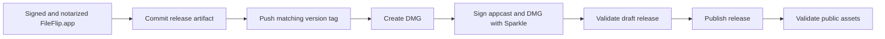

# Releasing File Flip for macOS

**Doc of record. Last verified: 2026-07-31.**

## Recommendation

The tag-triggered release workflow starts from the exact signed, stapled, and Apple-notarized `release-artifacts/FileFlip.app`. It creates the DMG, generates and signs the Sparkle appcast, validates a draft release, and publishes only after the downloaded updater assets pass. The workflow does not rebuild or modify the application bundle and does not require Apple signing credentials.

Sections 1–5 remain the manual fallback and release-gate reference. The normal publishing path is section 6.

## Release flow



## Prerequisites

- Apple Developer Program membership.
- A `Developer ID Application` certificate installed in Keychain.
- Hardened Runtime and production entitlements configured for the app.
- A `notarytool` Keychain profile named `FILEFLIP_NOTARY`, or a deliberately chosen replacement used consistently below.
- GitHub CLI authentication if using the manual command-line publishing flow.
- Sparkle 2.9.4 tools resolved from the pinned package dependency. Store the matching Ed25519 private key only in the GitHub Actions repository secret `SPARKLE_PRIVATE_KEY`; for manual fallback, store it in Keychain under account `com.chasedputnam.FileFlip`.

Verify updater tooling and signing access before building:

```sh
python3 scripts/check-updater-config.py
.build/artifacts/sparkle/Sparkle/bin/generate_keys \
  --account com.chasedputnam.FileFlip -p
```

**Expected:** the configuration check prints `Updater configuration is consistent and fail-closed`; `generate_keys` prints the same public key as `release/release-contract.json`. Otherwise STOP before producing release artifacts.

## 1. Build and sign the Release application

Do not distribute the ad-hoc-signed local development build produced with:

```sh
CODE_SIGN_IDENTITY=-
```

For the first release, use Xcode:

1. Select **Product → Archive**.
2. Open **Organizer** and select the archive.
3. Choose **Distribute App → Developer ID**.
4. Export the signed application.

All nested executables and frameworks must be signed correctly. Do not repair the final bundle with a blanket `codesign --deep`; build and packaging should sign nested code in the correct inside-out order.

Verify the exported app:

```sh
codesign --verify --deep --strict --verbose=2 \
  "/path/to/File Flip.app"

spctl --assess --type execute --verbose=4 \
  "/path/to/File Flip.app"
```

## 2. Package the application

Prefer a conventional DMG containing:

- `File Flip.app`
- A shortcut to `/Applications`

Use a stable public asset name such as `FileFlip.dmg` if the website should link directly to the latest download. A versioned filename such as `FileFlip-1.0.0.dmg` is suitable when the website links to the GitHub release page instead.

## 3. Notarize with Apple

Submit the distributable artifact and wait for a final result:

```sh
xcrun notarytool submit FileFlip.dmg \
  --keychain-profile FILEFLIP_NOTARY \
  --wait
```

Proceed only when Apple reports `status: Accepted`. On rejection, retrieve and inspect the log:

```sh
xcrun notarytool log <SUBMISSION_ID> \
  --keychain-profile FILEFLIP_NOTARY \
  notarization-log.json
```

## 4. Staple and validate

```sh
xcrun stapler staple FileFlip.dmg
xcrun stapler validate FileFlip.dmg

spctl --assess \
  --type open \
  --context context:primary-signature \
  --verbose=4 \
  FileFlip.dmg
```

Mount the DMG and verify its contained application as well:

```sh
codesign --verify --deep --strict --verbose=2 \
  "/Volumes/File Flip/File Flip.app"

spctl --assess --type execute --verbose=4 \
  "/Volumes/File Flip/File Flip.app"
```

Do not modify or rebuild the artifact after these checks.

## 5. Generate updater metadata and run the repository release gate

The updater metadata must be generated from the exact notarized DMG. Do not rebuild, rename, or modify that candidate after this point. Set one landing zone and the release identity. `UPDATER` must name a nonexistent destination; the preparation script creates it atomically. Create only its parent if needed:

```sh
ROOT="$PWD"
APP="/absolute/path/to/FileFlip.app"
DMG="/absolute/path/to/FileFlip.dmg"
TAG="v1.0.0"
NOTES="/absolute/path/to/release-notes.md"
UPDATER="/absolute/path/to/nonexistent-updater-output"
REPORT="/absolute/path/to/media-matrix.json"
SMOKE_LOG="/absolute/path/to/installation-smoke.log"
REVISION="release-revision"
test ! -e "$UPDATER" || { printf 'Updater output already exists: %s\n' "$UPDATER" >&2; exit 1; }
mkdir -p "$(dirname "$UPDATER")"
```

For the first public release, declare the absence of a prior stable feed:

```sh
HISTORY=(--initial-release)
```

For every later release, download the currently published signed feed before changing the GitHub release:

```sh
PREVIOUS_APPCAST="/absolute/path/to/previous-appcast.xml"
curl --fail --location --proto '=https' \
  "https://github.com/chasedputnam/file-flip/releases/latest/download/appcast.xml" \
  --output "$PREVIOUS_APPCAST"
HISTORY=(--previous-appcast "$PREVIOUS_APPCAST")
```

Generate the signed appcast and checksum:

```sh
python3 scripts/prepare-updater-release.py \
  --app "$APP" \
  --dmg "$DMG" \
  --tag "$TAG" \
  --release-notes "$NOTES" \
  --output-dir "$UPDATER" \
  "${HISTORY[@]}"
```

**Expected:** exit 0 and `Updater release metadata is candidate-bound and valid`. The output directory contains `FileFlip.dmg`, `FileFlip.dmg.sha256`, `appcast.xml`, and the release-notes file. Otherwise STOP; do not create a GitHub Release.

The gate also requires candidate-bound packaged-media evidence. Run these commands against the same application:

```sh
FILECONVERT_REVISION="$REVISION" swift run packaged-media-matrix \
  --app "$APP" \
  --fixtures "$ROOT/Tests/Fixtures/Media/manifest.json" \
  --report "$REPORT"

scripts/smoke-installed-media.sh \
  "$APP" \
  "$ROOT/Tests/Fixtures/Media/manifest.json" > "$SMOKE_LOG"
```

Copy `release/evidence.example.json` to the release evidence location. Record the exact argument arrays above, their artifacts, timestamps, revision, and passing statuses under `packagedMedia`. The matrix report must contain exactly 76 passing non-identity routes (56 audio and 20 video), zero failures, and zero skips. The gate recomputes the application-tree digest and packaged manifest hash, rechecks fixture and public-declaration drift, and rejects stale, duplicated, malformed, source-only, or differently generated evidence.

Run the fail-closed release gate against the app and the exact generated updater assets:

```sh
python3 scripts/release-readiness.py \
  --app "$APP" \
  --data-root "$HOME/Library/Application Support/app.fileconvert.FileConvert" \
  --evidence /absolute/path/to/release-evidence.json \
  --dmg "$UPDATER/FileFlip.dmg" \
  --appcast "$UPDATER/appcast.xml" \
  --checksum "$UPDATER/FileFlip.dmg.sha256" \
  --release-tag "$TAG" \
  "${HISTORY[@]}"
```

**Expected:** exit 0 and `RELEASE READY`. Any updater signature, digest, version/build ordering, tag, architecture, minimum-macOS, application-identity, or HTTPS URL mismatch closes the gate. `release/release-contract.json` is the source of truth.

## 6. Publish through GitHub Releases

Place the exact notarized application at `release-artifacts/FileFlip.app`, commit it with the source revision being released, and confirm its `CFBundleShortVersionString`. Push a tag equal to `v` plus that version:

```sh
/usr/libexec/PlistBuddy -c 'Print :CFBundleShortVersionString' \
  release-artifacts/FileFlip.app/Contents/Info.plist
git tag v0.1.0
git push origin v0.1.0
```

**Expected:** the printed version and tag agree exactly. The `Publish GitHub release` workflow then:

1. Verifies the application version, tag, Developer ID signature, stapled notarization ticket, and Gatekeeper acceptance.
2. Resolves the pinned Sparkle 2.9.4 tools and imports `SPARKLE_PRIVATE_KEY` into the ephemeral runner Keychain.
3. Rejects a private key whose derived public key differs from the application's `SUPublicEDKey`.
4. Creates a branded `FileFlip.dmg` containing the unchanged `FileFlip.app`, an `/Applications` shortcut, a website-styled installation background, and fixed Finder icon positions that visually direct the drag operation.
5. Downloads and verifies the previous signed `appcast.xml` when a published release already exists; absence or invalid history fails closed.
6. Generates and validates `FileFlip.dmg`, `FileFlip.dmg.sha256`, and the signed `appcast.xml`.
7. Generates `file-flip-<version>-source.zip` without `release-artifacts/`.
8. Creates a draft release, downloads all assets, and validates the updater set again.
9. Publishes the draft, downloads the public updater assets over HTTPS, and validates them again.

The four explicit release assets are:

- `FileFlip.dmg`
- `FileFlip.dmg.sha256`
- `appcast.xml`
- `file-flip-<version>-source.zip`

> **POINT OF NO RETURN:** publication exposes the signed feed and installable artifact to existing clients.

The stable feed URL is `https://github.com/chasedputnam/file-flip/releases/latest/download/appcast.xml`. The DMG enclosure URL is immutable and versioned: `https://github.com/chasedputnam/file-flip/releases/download/v<version>/FileFlip.dmg`.

## Emergency containment and rollback

Before publication, delete a rejected draft with `gh release delete "$TAG" --yes`; no client can discover it. After publication, do not mutate or replace signed assets. If verification identifies a release-breaking issue, immediately remove the release from stable discovery:

```sh
gh release edit "$TAG" --draft
```

Then prepare a new release with a strictly greater version and build number through the complete procedure. Clients that already downloaded metadata remain protected by Sparkle's feed and archive signatures, but a functional defect requires a fixed higher release.

## Workflow security boundary

The GitHub runner receives only the Sparkle Ed25519 private key. Apple Developer ID and notarization credentials remain outside GitHub because the committed application must already be signed, stapled, and notarized. The workflow creates a new DMG around that immutable application; Sparkle's Ed25519 signature and signed feed protect the downloaded DMG, while Gatekeeper validates the notarized application inside it.

The workflow fails before publication on a missing or mismatched Sparkle key, invalid application signature or notarization, missing previous appcast, non-increasing version/build, changed DMG payload, unsigned feed, invalid enclosure URL, checksum mismatch, or failed draft validation. A failed pre-publication validation deletes the draft rather than exposing a partial release.

## References

- [Apple: Notarizing macOS software before distribution](https://developer.apple.com/documentation/security/notarizing_macos_software_before_distribution)
- [GitHub: Managing releases in a repository](https://docs.github.com/en/repositories/releasing-projects-on-github/managing-releases-in-a-repository)
