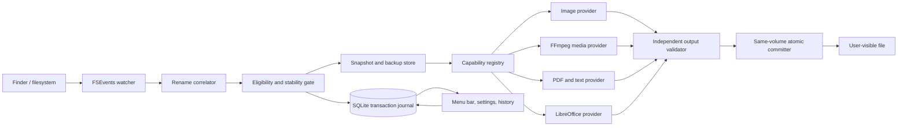

# Design — macOS-extension-converter

Approved by: Chase Putnam  Date: 2026-07-28  Status: approved

## 1. Overview

The application is an Apple Silicon-only, native macOS 14+ menu-bar utility written in Swift. The generated Xcode project, bundled executables, runtime manifests, and release gates all require arm64 and reject architecture drift. It watches only user-authorized directory trees, correlates extension-changing renames, stages an immutable snapshot, delegates conversion to a format-family provider, independently validates the result, and atomically replaces the renamed file only after a recoverable backup exists.

The central design rule is **fail closed around user files**: an incomplete rename event, uncertain source type, unavailable provider, ambiguous fidelity policy, changed source, failed backup, invalid output, or interrupted commit results in no replacement. Broad format coverage is supplied by multiple narrow providers rather than one converter with implicit behavior.

This design addresses Requirements 1–8. The broad MVP is feasible, but office conversion is intentionally an optional local capability until a supported LibreOffice installation is present. The UI still ships as one application; provider availability controls which pairs are advertised.

## 2. Architecture



### 2.1 Runtime topology

- **Host application:** SwiftUI `MenuBarExtra` with an AppKit settings/onboarding window where needed. `LSUIElement=true` keeps it out of the Dock. The host owns monitoring, authorization, policy, journaling, history, and final filesystem mutation.
- **Conversion coordinator:** a Swift actor serializes state transitions and limits concurrency. Default concurrency is two independent jobs; office jobs are serialized because LibreOffice profiles and startup cost make parallel operation fragile.
- **Provider processes:** media and office conversion run out of process with fixed executable paths and direct argument arrays—never a shell command. Inputs are private staged copies; providers never receive a watched-folder path and cannot perform final replacement.
- **Persistence:** SQLite in WAL mode stores durable job state and history. Backups and staging artifacts live in `~/Library/Application Support/<bundle-id>/` with owner-only permissions. The final output is copied to a hidden temporary sibling of the target so the last rename occurs on the target volume.
- **Distribution:** direct signed and notarized distribution with hardened runtime. Mac App Store distribution is out of scope. The app has no network client or analytics SDK.

### 2.2 Event-to-commit flow

1. The watcher starts an FSEvent stream for authorized roots with file-level events, extended file IDs, and a dispatch queue.
2. The correlator pairs old/new rename events by event ID and file identity. It accepts only a regular file whose basename is unchanged and extension changed. Missing or ambiguous pairs are skipped; a directory rescan never invents conversion intent.
3. The stability gate canonicalizes both root and candidate paths, confirms the candidate remains below an enabled root, rejects links/packages/temporary names, and samples device, inode, size, and modification time twice across a 500 ms quiet interval.
4. The detector inspects content, not the requested extension. ImageIO, PDFKit, ZIP package markers, strict text parsers, and `ffprobe` cover their respective families. A single capability-registry lookup must explicitly allow the detected source and requested target.
5. The coordinator creates a journal row and copies or clones the source into a unique private job directory. It hashes the staged source with SHA-256 and verifies the live file still has the same identity and bytes.
6. The backup store persists the exact staged bytes plus old/new relative names and restorable metadata. The job cannot enter `converting` until the backup is durable.
7. The selected provider writes only into the job directory. It receives typed policy values, a deadline, and output-size bounds—not arbitrary command-line fragments.
8. A validator independent of the conversion command probes/decodes the output and checks requested type plus family invariants: image geometry, media duration/streams, PDF page count, or document/spreadsheet readability.
9. Immediately before commit, the coordinator rechecks target identity and source hash. If anything changed, the validated output is retained only as a failed-job artifact and the user file is untouched.
10. The committer copies the validated output to a hidden sibling, flushes file data, and atomically replaces the renamed source. The journal transition to `succeeded` and cleanup are then completed. A crash-recovery pass reconciles any `committing` row using hashes of the live file, sibling temp, output, and backup.

### 2.3 Dropped and replayed events

FSEvents is notification infrastructure, not a transaction log. When the stream reports user/kernel drops or root changes, the watcher enters a degraded state, records a new cursor, refreshes only its identity snapshot, and resumes from new events. It **does not convert mismatched files discovered by a rescan**, because that would reinterpret old files as rename intent. Replayed events are deduplicated against `(volume UUID, file ID, requested format, source hash)` and terminal jobs in the journal.

## 3. Components and Interfaces

### 3.1 Application shell

Responsibilities:

- onboarding and `NSOpenPanel` folder selection;
- menu-bar active/paused/error state;
- settings, history, provider status, policy choices, and undo;
- launch-at-login registration through `SMAppService.mainApp`;
- local notifications for failures or required choices.

The shell observes immutable view-state projections from the coordinator. UI code never mutates files directly.

### 3.2 Folder authorization store

Each watched root stores a security-scoped bookmark, display path, volume identity, enabled state, and latest event cursor. Bookmark resolution must remain within the exact selected root. Stale bookmarks are refreshed only after renewed user selection. Even for direct distribution, security-scoped bookmarks make user intent explicit and preserve a future sandbox path.

### 3.3 Filesystem watcher and rename correlator

```swift
struct RenameCandidate: Sendable {
    let eventID: UInt64
    let fileKey: FileKey
    let oldRelativePath: String
    let newRelativePath: String
    let observedAt: Date
}

protocol RenameEventSource: Sendable {
    func events(for roots: [AuthorizedRoot]) -> AsyncThrowingStream<FileEvent, Error>
}
```

The correlator emits a candidate only after it has both sides of a rename and can prove the final object is the same regular file. It bounds unpaired-event memory by age and count. Event pairing is an optimization signal, never authority to bypass current filesystem checks.

### 3.4 Content detector

```swift
enum DetectedFormat: Hashable, Codable, Sendable {
    case image(ImageFormat)
    case audio(AudioFormat)
    case video(VideoFormat)
    case document(DocumentFormat)
    case spreadsheet(SpreadsheetFormat)
}

protocol ContentDetector: Sendable {
    func detect(_ snapshot: Snapshot) async throws -> DetectedFormat
}
```

Detection is layered and bounded:

- image: `CGImageSourceCopyType` plus a decode probe;
- PDF: `%PDF-` signature plus `PDFDocument` open;
- OOXML/ODF: ZIP central-directory inspection with entry-count, path, and uncompressed-size limits; content-type markers distinguish DOCX/XLSX/ODT/ODS;
- text/Markdown/HTML/CSV: bounded UTF-8/UTF-16 decoding plus strict family-specific probes;
- media: the pinned `ffprobe` binary emits bounded JSON parsed with unknown-field tolerance only inside the provider adapter; selected fields are copied into a strict internal model.

Extension, Finder kind, and `URLResourceValues.contentType` may assist UI labels but cannot authorize conversion.

### 3.5 Capability registry

```swift
struct ConversionCapability: Hashable, Sendable {
    let source: DetectedFormat
    let targetExtension: String
    let providerID: ProviderID
    let defaultPolicy: ConversionPolicy
    let lossProfile: LossProfile
}

protocol ConversionProvider: Sendable {
    var id: ProviderID { get }
    func health() async -> ProviderHealth
    func capabilities() async -> Set<ConversionCapability>
    func convert(_ request: ConversionRequest) async throws -> ProducedArtifact
}
```

The registry is the single allowlist. A pair is visible only when its provider passes executable/version/license checks and a startup self-test. Capabilities are versioned and displayed in settings with fidelity limits.

### 3.6 Provider implementations

#### Native image provider

Uses ImageIO/CoreGraphics for JPEG, PNG, HEIC/HEIF, TIFF, and WebP capabilities that `CGImageDestination` reports as writable at runtime. It preserves orientation by rendering to the canonical pixel orientation, carries ICC profiles where the destination supports them, and blocks unconfigured transparency or multi-frame loss.

#### Media provider

Invokes a pinned, separately signed FFmpeg/ffprobe build as child processes. The distributable build is compiled without `--enable-gpl` and `--enable-nonfree`; its exact source archive, build configuration, notices, and license are released with the application. Default codec mappings favor Apple hardware encoders where available and software fallbacks in the same approved capability. Process output is capped, conversion has a wall-clock deadline, and cancellation terminates the entire process group.

**Release gate:** codec patent and LGPL compliance require legal review before commercial distribution. The design does not treat open-source licensing as patent clearance.

#### Native PDF and text provider

Uses PDFKit/CoreGraphics for PDF page rasterization and extractable-text output. Markdown-to-HTML uses a pinned Swift Markdown parser and a deterministic renderer; HTML-to-Markdown accepts a documented safe subset. Markdown-to-PDF renders that deterministic HTML to PDF in an isolated `WKWebView` with network loading disabled. Unsupported HTML constructs generate a fidelity warning or rejection rather than silent deletion.

#### Office provider

Discovers a user-installed, signed LibreOffice application and invokes `soffice --headless --convert-to` with an isolated per-job `UserInstallation` profile and output directory. It verifies bundle identifier, code signature, minimum/maximum tested version, available filter, and startup self-test before advertising office/spreadsheet capabilities. It never uses the user's normal LibreOffice profile. If LibreOffice is absent or outside the tested range, office pairs remain unavailable with installation guidance.

This choice avoids embedding hundreds of megabytes of office code in the app and keeps LibreOffice licensing/updating separate. Its cost is that broad office support is not zero-install; this is a visible MVP limitation, not a hidden fallback.

### 3.7 Validator registry

Validators are selected by requested target, not by provider. They must open/decode the produced artifact and verify its detected type. Additional checks compare source/output facts that should survive the selected policy:

- image: nonzero expected dimensions, orientation applied, required alpha/profile behavior;
- audio/video: decodable streams, nonzero duration, duration delta within max(250 ms, 0.5%), selected stream count, no provider-reported truncation;
- PDF: readable document and expected nonzero page count;
- DOCX/XLSX/ODT/ODS: valid bounded ZIP package with required root relationships/mimetype and successful read probe;
- TXT/HTML/Markdown/CSV: strict decoding and policy-specific structural checks.

A provider's zero exit status is never sufficient validation.

### 3.8 Transaction coordinator and committer

Only the coordinator can advance jobs or call the committer. Allowed transitions are encoded as an enum-backed state machine:

```text
discovered -> stabilizing -> staged -> backedUp -> converting
           -> validating -> readyToCommit -> committing -> succeeded

Any pre-commit state -> skipped | failed | cancelled
committing -> succeeded | needsRecovery
```

A terminal job is immutable except for backup expiration and user-initiated undo metadata. The committer accepts only a `ValidatedArtifact` type constructed by the validator, making unvalidated replacement unrepresentable in normal code.

### 3.9 Undo and retention

Undo verifies that the current file still matches the committed output hash. If it does, the backup is copied to a same-volume sibling and atomically restored, then renamed to the pre-trigger relative name. If the current file differs or the old name is occupied, automatic replacement is refused and the backup is restored to a conflict-free sibling chosen by the user.

Default retention is 30 days or 10 GiB, whichever boundary is reached first; pruning is oldest-first and never touches a job in progress, `needsRecovery`, or an active undo. Settings show current backup usage and policy.

## 4. Data Models

### 4.1 SQLite schema

#### `authorized_root`

| Field | Type | Notes |
|---|---|---|
| `id` | UUID text | Primary key |
| `bookmark` | blob | Security-scoped bookmark |
| `display_path` | text | Local UI only; never general logs |
| `volume_uuid` | text | Detects remount/replacement |
| `enabled` | integer | Boolean |
| `event_cursor` | integer | Latest accepted FSEvent ID |
| `status` | text | active, paused, permissionLost, degraded |

#### `conversion_job`

| Field | Type | Notes |
|---|---|---|
| `id` | UUID text | Primary key |
| `root_id` | UUID text | Authorized-root foreign key |
| `file_key` | text | Volume UUID + filesystem file ID |
| `old_relative_path` / `new_relative_path` | text | Root-relative, normalized paths |
| `source_format` / `target_format` | text | Versioned enum values |
| `provider_id` / `provider_version` | text | Exact converter identity |
| `policy_json` | blob | Strictly decoded versioned policy |
| `source_hash` / `output_hash` | blob | SHA-256 |
| `state` | text | State-machine value |
| `created_at` / `updated_at` | timestamp | UTC |
| `error_code` / `error_detail` | text | Redacted, bounded detail |

A unique index on file key, target format, and source hash prevents duplicate terminal conversions.

#### `backup`

| Field | Type | Notes |
|---|---|---|
| `job_id` | UUID text | Primary/foreign key |
| `relative_storage_path` | text | Never an arbitrary absolute path |
| `byte_count` | integer | Retention accounting |
| `sha256` | blob | Exact restore verification |
| `metadata` | blob | Versioned restorable metadata |
| `expires_at` | timestamp | Retention boundary |

#### `provider_installation`

Stores provider ID, executable identity, version, code-signature result, build configuration hash, capability-set hash, and last self-test outcome. It stores no secrets.

### 4.2 Policy model

`ConversionPolicy` is a tagged, versioned enum; unknown fields or versions are rejected rather than ignored. Family policies include:

- image quality, alpha background, animation/page selection, metadata mode;
- audio codec/bitrate/sample-rate and selected tracks;
- video codec/quality/audio codec and selected streams/subtitles;
- document fidelity-warning acceptance and embedded-resource behavior;
- spreadsheet selected sheet, CSV delimiter/encoding, and formula-value policy.

Defaults are immutable per application version and copied into each job so a settings change cannot alter queued work silently.

### 4.3 Trust boundaries

| Entry point | Untrusted input | Boundary control | Failure behavior |
|---|---|---|---|
| FSEvents | paths, flags, ordering | pair correlation, canonicalization, root containment, current `lstat` | skip |
| User file | bytes, size, package structure | bounded probes, no macro execution, staged snapshot | reject/skip |
| Preferences DB | old/invalid policy data | strict versioned decoding | disable affected rule |
| FFmpeg/LibreOffice | executable and output | pinned path/signature/version, fixed args, deadline, output bounds, independent validation | disable provider/fail job |
| Provider stdout/stderr | arbitrary text | byte cap, structured adapter, redaction | terminate/fail job |
| Final filesystem | concurrent changes, disk/full permissions | identity/hash recheck, same-volume temp, atomic replace | preserve source/recover |

No provider gets network authorization from the application, and rendered HTML is configured to reject external resource loads. Macro execution, links escaping the staged directory, archive traversal, and decompression bombs are denied.

## 5. Error Handling

### 5.1 Error classes

- **Skipped:** not a confirmed extension-only rename, matching content/extension, unsupported pair, or event replay. Usually silent; visible in diagnostics only when actionable.
- **Needs choice:** conversion would discard structure or needs a page/sheet/background/stream policy. Source remains untouched; menu item and notification offer the exact setting.
- **Provider unavailable:** missing, untrusted, unhealthy, or incompatible executable. Affected pairs disappear from active capability lists; existing queued jobs fail closed.
- **Conversion failed:** nonzero exit, timeout, cancellation, bounded-output violation, or unreadable output. Source stays as renamed original bytes; backup remains for diagnosis/undo.
- **Commit conflict:** file identity or hash changed after staging. Output is not committed; no overwrite prompt defaults to destructive behavior.
- **Needs recovery:** crash or I/O ambiguity during the atomic commit window. Monitoring pauses for that file, and startup reconciliation chooses among hashes; if no single safe answer exists, both original backup and candidate output are preserved and the user is prompted.
- **Permission/disk error:** monitoring or conversion pauses only for the affected root/job. Other roots continue.

### 5.2 Crash consistency

Every state transition and artifact path is committed to SQLite before the side effect it authorizes. Recovery is idempotent:

- before `committing`: delete unvalidated temporaries, keep source and backup;
- `committing` with live hash equal to output hash: mark succeeded;
- `committing` with live hash equal to source hash: remove sibling temp and mark failed;
- neither hash: mark `needsRecovery`, preserve all artifacts, and never overwrite automatically.

### 5.3 Resource limits

Defaults, adjustable only through typed settings:

- two concurrent conversions; one LibreOffice conversion;
- 500 ms stability interval, maximum 30 seconds waiting for stability;
- 15-minute conversion timeout;
- provider stdout/stderr capped at 1 MiB per stream;
- package probes capped at 100,000 entries, 4 GiB declared uncompressed data, and 100:1 expansion ratio;
- output size capped at max(2 × source size, source size + 1 GiB) unless a format policy explicitly allows more;
- insufficient space check requires backup bytes + output cap + 256 MiB reserve.

Limit failures are user-visible and never relax automatically.

## 6. Testing Strategy

### 6.1 Unit tests — evidence rung 1

- rename-pair correlation, missing halves, reordered events, dropped-event transitions, replay deduplication;
- canonical path/root containment, symlink/package/temp rejection, Unicode/case-sensitive volume behavior;
- capability allowlist and provider-health gating;
- strict policy decoding and every state-machine transition;
- retention ordering and undo conflict naming;
- command construction tests proving direct argv use and rejecting arbitrary provider options.

### 6.2 Contract and golden tests — evidence rung 2

A versioned fixture matrix contains at least one representative input for every advertised source-to-target pair plus edge fixtures for transparency, orientation, multi-frame images, multiple media streams, subtitles, multi-page documents, formulas, multiple sheets, CSV encodings, malformed packages, and oversized declarations.

Each successful output is checked by an independent validator. Semantic extracts—dimensions, duration/streams, PDF page count/text, OOXML/ODF package structure, spreadsheet cell values—are normalized and compared with reviewed goldens. Golden regeneration is explicit and never occurs during a normal test run.

### 6.3 Integration tests — evidence rung 3

- real pinned FFmpeg/ffprobe binaries convert the full media fixture matrix;
- every supported LibreOffice version runs headless with a unique temporary profile against office fixtures;
- ImageIO/PDFKit/WKWebView providers run on both oldest-supported macOS and current macOS;
- SQLite plus real APFS directories exercise stage, backup, sibling temp, atomic replacement, retention, and undo;
- provider termination, disk-full simulation, permission denial, corrupt output, source mutation, and process crash are injected at every transaction boundary.

### 6.4 End-to-end tests — evidence rung 4

A signed development app monitors a temporary user-authorized folder. Tests rename files through `FileManager` and verify the same FSEvents path used by Finder. A release-candidate smoke checklist additionally performs one real Finder rename per enabled format family, confirms menu-bar feedback, opens the result in an independent macOS application, exercises pause/resume, and undoes the conversion.

End-to-end coverage cannot prove fidelity for arbitrary real-world files, absence of undisclosed codec patents, or compatibility with future provider/macOS versions. Provider upgrades require rerunning the entire certified matrix before their capability set is enabled.

### 6.5 Pre-agreed acceptance thresholds

- **Source preservation:** 100% exact SHA-256 recovery across every injected failure/crash boundary; zero destructive outcomes permitted.
- **Advertised matrix:** 100% of certified fixtures produce independently readable target files; one failing pair removes that capability from the release.
- **Deduplication:** exactly one conversion across 1,000 generated duplicate/reordered event sequences per candidate.
- **Detection responsiveness:** for a stable local file under 10 MiB, p95 time from completed rename to queued job is at most 2 seconds on the oldest supported Mac test host.
- **Idle footprint:** over a 10-minute idle measurement with two watched folders, average CPU is at most 0.5%, no content scan occurs, and resident memory is at most 100 MiB.
- **Privacy:** a network-capture test observes zero outbound connections during onboarding, monitoring, all provider conversions, history, and undo.

Thresholds are changed only in a separately reviewed specification update, never merely to make an implementation pass.

## 7. Key Decisions

1. **Native Swift menu-bar host:** best macOS integration and smallest always-on footprint. Rejected Electron/Tauri because a web runtime adds idle cost and does not simplify FSEvents, bookmarks, atomic replacement, or native conversion APIs.
2. **FSEvents file-level monitoring plus strict rename correlation:** recursive and efficient. Rejected directory polling because it wastes resources and cannot reliably distinguish rename intent from existing mismatches. Rejected Endpoint Security because it requires special entitlements and is disproportionate for a user utility.
3. **Journaled copy-validate-atomic-replace transaction:** preserves the source until the last same-volume operation. Rejected in-place conversion and rename-back-on-failure because crashes can destroy the only copy.
4. **Explicit capability allowlist:** broad coverage without false promises. Rejected extension-driven dispatch because extensions are untrusted and not every pair has defined semantics.
5. **Multiple providers behind one contract:** native APIs for low-cost cases, pinned FFmpeg for media breadth, and installed LibreOffice for office fidelity. Rejected one monolithic bundled office/media runtime because of size, update, security, and licensing burden.
6. **Installed LibreOffice rather than bundled LibreOffice:** keeps the core download and notarization surface manageable. Rejected bundling for MVP; consequence: office features require a separate local installation and tested-version gate.
7. **SQLite transaction journal:** durable recovery and deduplication need transactions and indexed queries. Rejected UserDefaults/JSON because partial writes and concurrent history updates would create recovery ambiguity.
8. **Direct distribution, hardened runtime, no app sandbox for MVP:** recursive monitoring and multiple converter executables are feasible without private entitlements. User authorization, staged-only provider input, fixed commands, and code-signature checks still constrain behavior. Rejected Mac App Store-first because sandbox/provider constraints would dominate the MVP. A sandboxed build remains a future security objective.

These decisions are proposed until this design is approved. Decisions 2, 3, 5, 6, and 8 are expensive to reverse and should be promoted to accepted ADRs before implementation.

## 8. Risks and Known Limitations

- **Broad MVP matrix:** fixture and regression cost grows by source-target pair, not format count. Mitigation: explicit capabilities and removing any pair that lacks certified fixtures.
- **Office fidelity:** LibreOffice conversions can reflow fonts/layout and CSV cannot represent multiple sheets or formulas. Mitigation: warnings, explicit sheet/formula policies, semantic validation, and no PDF-to-DOCX claim.
- **Optional office installation:** a fresh app cannot perform office conversions until LibreOffice is installed. Accepted MVP tradeoff; settings show provider state before the user attempts a rename.
- **Codec licensing/patents:** an LGPL-compatible FFmpeg build does not resolve codec patent obligations. Mitigation: exact build inventory and legal release gate; no `--enable-gpl` or `--enable-nonfree` build in proprietary distribution.
- **Untrusted parser surface:** images, media, and office files exercise complex parsers. Mitigation: staging, process isolation for external providers, resource limits, no macros/network, current signed providers, and independent validation. Residual risk remains higher without a fully sandboxed provider architecture.
- **FSEvents ambiguity:** event drops and cross-root moves can lose a complete rename pair. Mitigation: skip conversion rather than infer intent; the file remains unchanged.
- **External/removable volumes:** atomic replacement and metadata semantics vary by filesystem. Mitigation: same-directory temporary output, filesystem capability tests, and disabling conversion on volumes that fail the atomicity probe.
- **Backup growth:** large video conversions can consume significant disk. Mitigation: preflight capacity, 10 GiB/30-day default retention, visible usage, and no conversion if a backup cannot be guaranteed.
- **No repository baseline:** the current directory is not a Git repository and contains no application scaffold. The implementation plan must include repository/project initialization before feature code; specification artifacts are currently local-only until version control is established.

## 9. Requirement Traceability

| Requirement | Design coverage |
|---|---|
| 1 — Authorization | Application shell, folder authorization store, runtime topology |
| 2 — Eligibility | watcher, correlator, detector, dropped-event policy |
| 3 — Format coverage | provider implementations, capability registry, validators |
| 4 — Safety/undo | transaction flow, coordinator, committer, backup/undo, crash consistency |
| 5 — Menu bar | application shell, observable journal state, `SMAppService` |
| 6 — Privacy/history | SQLite models, local storage, trust boundaries, no-network architecture |
| 7 — Reliability | actors/concurrency, resource limits, replay handling, acceptance thresholds |
| 8 — Extensibility | provider/validator protocols, capability model, provider health gates |

## 10. Sources

- Apple, File System Events: https://developer.apple.com/documentation/coreservices/file_system_events
- Apple, `MenuBarExtra`: https://developer.apple.com/documentation/swiftui/menubarextra
- Apple, `SMAppService`: https://developer.apple.com/documentation/servicemanagement/smappservice
- FFmpeg, License and Legal Considerations: https://ffmpeg.org/legal.html
- LibreOffice, Starting with command-line parameters: https://help.libreoffice.org/latest/en-US/text/shared/guide/start_parameters.html
- Consul reference behavior: https://getconsul.app/
