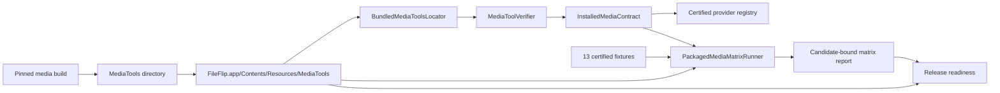

# Design — Packaged media conversions

Approved by: Product owner
Date: 2026-07-29
Status: approved

#[[file:requirements.md]]

## 1. Overview

The change makes the built `.app` the authority for installed media behavior. Xcode and Swift Package Manager both copy one complete `MediaTools` directory into the application resources; production startup resolves only that directory, verifies it, and registers capabilities from one shared installed-media contract. No runtime path searches, downloads, or external package managers participate.

The same contract drives production capability registration and a release-only matrix runner. The runner consumes 13 certified source fixtures, discovers tools inside a candidate `.app`, asserts the exact capability set, executes all 76 directed non-identity routes, verifies the source before and after each conversion, independently probes every output, and emits a candidate-bound JSON report. Release readiness rejects the candidate unless the complete report and installation smoke evidence match the exact signed application.



This design addresses Requirements 1–8. LibreOffice remains an optional, separately discovered provider and is not referenced by the media matrix.

## 2. Architecture

### 2.1 Canonical bundle layout

The installed layout is fixed:

```text
FileFlip.app/
└── Contents/
    └── Resources/
        └── MediaTools/
            ├── ffmpeg
            ├── ffprobe
            ├── manifest.json
            └── LICENSES/
                ├── ffmpeg.txt
                ├── lame.txt
                ├── libogg.txt
                ├── libvorbis.txt
                ├── libvpx.txt
                └── opus.txt
```

`Package.swift` retains `.copy("Resources/MediaTools")`. `scripts/generate-project.rb` stops adding media files individually to `PBXResourcesBuildPhase`, because that phase flattens file references. It adds the media directory as one folder resource or uses a resource copy phase whose destination is explicitly `$(CONTENTS_FOLDER_PATH)/Resources/MediaTools`. The generated Xcode project remains derived output from that script; the script and generated project change together.

A build-layout assertion inspects the produced `.app`, requires the exact directory above, rejects media artifacts flattened into `Contents/Resources`, and checks executable modes before any runtime test. This makes the bundle structure an enforced build contract rather than an Xcode-group convention.

Addresses Requirements 1.1–1.3, 1.6, 6.1, and 8.1.

### 2.2 Runtime discovery and bootstrap

Add `BundledMediaToolsLocator`, with one production operation:

```swift
public struct BundledMediaToolsLocator: Sendable {
    public func locate(in applicationBundle: Bundle) throws -> URL
}
```

It resolves `Contents/Resources/MediaTools`, canonicalizes it, requires it to remain under the application resource root, and returns no alternate path. Swift package tests may inject an explicit bundle or directory through initializers; production code never reads an environment override.

Extract packaged-provider setup from `ConversionEngine.initialize` into `PackagedMediaBootstrap`:

```swift
public struct PackagedMediaBootstrap: Sendable {
    public func load(from directory: URL) async throws -> PackagedMediaComponents
}

public struct PackagedMediaComponents: Sendable {
    public let tools: VerifiedMediaTools
    public let provider: FFmpegMediaProvider
    public let validator: CertificationValidator
}
```

`ConcreteApplicationRuntime` calls the locator, then the bootstrap, and registers the returned provider and validator. Any locator or verifier failure produces the existing unavailable-provider state and zero FFmpeg capabilities; it does not retry against `PATH`. The bootstrap is also the production entry point used by installation smoke and matrix code, preventing a parallel test-only activation path.

Non-media providers initialize independently. LibreOffice availability neither enables nor blocks packaged media.

Addresses Requirements 1.4–1.6, 2.2–2.3, 2.7, 7.2, 7.5, and 7.7.

### 2.3 Manifest generation and verification

Keep the manifest fail-closed and bump its schema only if fields change incompatibly. Correct the current build-configuration mismatch at the source by defining one canonical token representation:

1. Read bounded UTF-8 output from `ffmpeg -hide_banner -buildconf` and `ffprobe -hide_banner -buildconf`.
2. Locate configuration lines and tokenize their shell-quoted arguments with a strict, bounded POSIX-compatible lexer.
3. Reject unterminated quoting, escapes outside the accepted grammar, duplicate singleton flags, forbidden flags, unknown enablement flags, or output above the existing bound.
4. Store the canonical unquoted argument array and the SHA-256 of its newline-joined UTF-8 representation.
5. At runtime, apply the same token grammar to observed output before set and hash comparison.

The Python generator receives table-driven lexer fixtures shared as JSON with Swift verifier tests. The shared fixtures include unquoted values, single-quoted lists, quoted paths with spaces, escapes, malformed quoting, and semantically distinct values. Cross-language fixture parity prevents the generator and verifier from drifting while avoiding runtime execution of a shell.

Verification order remains cheap and fail-closed:

1. canonical directory and strict manifest shape;
2. contained regular files, no symlinks, exact artifact names, license records, and safe relative paths;
3. artifact hashes;
4. code signatures;
5. architecture;
6. version and canonical build configuration;
7. exact encoder/muxer/demuxer inventory;
8. bounded startup self-test in the sanitized environment.

`MediaToolVerifier` continues to execute only absolute packaged paths with `PATH=/usr/bin:/bin`, `HOME=/var/empty`, and `LANG=C`. FFmpeg remains built with network and autodetection disabled. Release signing signs nested Mach-O artifacts before the outer app; verification after signing proves the final signatures rather than accepting manifest assertions.

Addresses Requirements 1.7, 2.1–2.6, and 7.1–7.2.

### 2.4 Authoritative installed-media contract

Introduce `InstalledMediaContract` in `FileConvertProviders` as the only production mapping from logical media format to extension, aliases, family, encoder, muxer, admitted output codecs, and default stream contract. It is immutable code reviewed with provider changes.

```swift
public struct InstalledMediaFormat: Hashable, Sendable {
    public enum Family: String, Sendable { case audio, video }

    public let format: DetectedFormat
    public let canonicalExtension: String
    public let aliases: Set<String>
    public let requiredEncoder: String
    public let requiredMuxer: String
    public let admittedOutputCodecs: Set<String>
}

public enum InstalledMediaContract {
    public static let formats: [InstalledMediaFormat]
    public static func format(forExtension: String) -> DetectedFormat?
    public static func capabilities(for tools: VerifiedMediaTools) -> Set<ConversionCapability>
}
```

The exact entries are:

| Family | Logical format | Canonical extension | Aliases | Encoder | Muxer |
|---|---|---|---|---|---|
| Audio | MP3 | `mp3` | — | `libmp3lame` | `mp3` |
| Audio | M4A | `m4a` | — | `aac` | `ipod` |
| Audio | AAC | `aac` | — | `aac` | `adts` |
| Audio | WAV | `wav` | — | `pcm_s16le` | `wav` |
| Audio | AIFF | `aiff` | `aif` | `pcm_s16be` | `aiff` |
| Audio | FLAC | `flac` | — | `flac` | `flac` |
| Audio | OGG Vorbis | `ogg` | — | `libvorbis` | `ogg` |
| Audio | Opus | `opus` | — | `libopus` | `opus` |
| Video | MP4 | `mp4` | — | `mpeg4` fallback | `mp4` |
| Video | M4V | `m4v` | — | `mpeg4` fallback | `mp4` |
| Video | MOV | `mov` | — | `mpeg4` fallback | `mov` |
| Video | Matroska | `mkv` | — | `mpeg4` fallback | `matroska` |
| Video | WebM | `webm` | — | `libvpx-vp9` | `webm` |

The contract records admitted codecs separately from the preferred encoder so hardware H.264 output can be accepted where available while packaged MPEG-4 software fallback remains mandatory. MP4, M4V, and MOV remain distinct logical targets even when they share ISO base-media machinery. AAC maps to raw ADTS AAC, never M4A.

`FFmpegMediaProvider.capabilities`, command construction, `ConcreteApplicationRuntime.targetFormat`, `FFProbeContentProbe`, `FFprobeMediaValidator`, fixture records, and matrix expectations consume this contract. Existing private mapping tables are removed. The capability constructor creates same-family Cartesian products and removes identity pairs, yielding exactly 56 audio plus 20 video routes when the approved inventory is present.

Addresses Requirements 3.1–3.6, 4.1–4.8, 6.2, 7.4, and 8.6.

## 3. Components and Interfaces

### 3.1 Media build pipeline

`scripts/build-media-tools.sh` remains the reproducible producer. It downloads only pinned archives, verifies source hashes, builds arm64 static third-party codec libraries, disables network/GPL/nonfree features, signs both executables, and atomically replaces the resource directory after manifest generation succeeds.

Changes:

- use repository paths with the repository's actual case;
- ensure local ad-hoc or supplied Developer ID signatures are applied after final binary mutation;
- run manifest generation and a verifier smoke check before publishing resources;
- retain no build-machine path as a runtime lookup;
- keep source and license evidence in the manifest.

The FFmpeg executable may retain build paths in informational configuration output because verification canonicalizes the observed binary and manifest consistently; application behavior never resolves those paths.

### 3.2 `MediaToolVerifier`

Responsibilities:

- strict bounded parsing;
- filesystem containment and regular-file enforcement;
- actual hash, signature, architecture, version, configuration, inventory, and self-test observations;
- construction of `VerifiedMediaTools` only after every check succeeds.

The verifier returns one typed success value or throws; it never returns a partially usable toolset. Test-only signature relaxation remains unavailable to production and is prohibited in the release matrix.

### 3.3 `FFmpegMediaProvider`

The provider derives capabilities and target commands from `InstalledMediaContract`. It retains:

- absolute executable URL;
- sanitized environment;
- `-nostdin`, `-xerror`, no-overwrite, explicit input and output paths;
- explicit stream selection;
- deadline and output-size enforcement;
- output-directory containment;
- packaged software fallback for non-WebM video.

A conversion is successful only when FFmpeg exits zero and returns one bounded regular artifact. Success does not certify content; certification remains the validator's responsibility.

### 3.4 `FFprobeMediaValidator`

Extend the validation expectation/result to carry stable facts needed by the matrix without coupling normal transactions to test code:

```swift
public struct MediaFacts: Codable, Hashable, Sendable {
    public let format: DetectedFormat
    public let durationMilliseconds: Int64
    public let streams: [MediaStreamFacts]
}

public struct MediaStreamFacts: Codable, Hashable, Sendable {
    public let kind: MediaStreamKind
    public let codec: String
    public let frameCount: Int?
    public let sampleRate: Int?
    public let channels: Int?
    public let width: Int?
    public let height: Int?
}
```

Production validation still enforces target format, selected stream counts, bounds, and decodability. The richer facts allow fixture certification and matrix reporting to assert admitted codecs, positive duration/frame evidence, non-silent fixture properties established by generation, audio properties, and video dimensions. Parsing remains bounded and rejects malformed, missing, non-finite, negative, or contradictory values.

### 3.5 Certified media fixtures

Add:

```text
Tests/Fixtures/Media/
├── manifest.json
├── audio/
│   ├── source.mp3
│   ├── source.m4a
│   ├── source.aac
│   ├── source.wav
│   ├── source.aiff
│   ├── source.flac
│   ├── source.ogg
│   └── source.opus
└── video/
    ├── source.mp4
    ├── source.m4v
    ├── source.mov
    ├── source.mkv
    └── source.webm
```

All fixtures are short, deterministic, synthetic media. Audio uses a fixed non-silent signal. Video uses fixed changing frames plus the same non-silent audio. Inputs are bounded to keep the 76-route suite practical.

`scripts/generate-media-fixtures.py` has compare-only behavior by default. Regeneration requires `FILECONVERT_UPDATE_FIXTURES=1 --update`, a specific verified media-tool directory, and an empty staging directory. It generates every file from one pinned recipe, probes it, writes normalized facts, records provenance/license/tool version, and atomically updates bytes and manifest. The script never rewrites expected data during an ordinary test run.

Extend `scripts/check-fixtures.py` or add a media-specific verifier that validates strict manifest shape, exact 13-format set, safe paths, hashes, lengths, provenance, licenses, and fact fields before invoking the actual packaged ffprobe for fact comparison.

### 3.6 `PackagedMediaMatrixRunner`

Add a non-shipping Swift executable target used only for verification:

```text
swift run packaged-media-matrix \
  --app /path/to/FileFlip.app \
  --fixtures Tests/Fixtures/Media/manifest.json \
  --report /path/to/media-matrix-report.json
```

The runner:

1. requires an absolute candidate `.app` and output path;
2. computes candidate identity before execution;
3. locates and strictly verifies the packaged provider through production bootstrap;
4. certifies all 13 fixtures before conversion;
5. compares actual capability set to the exact expected set;
6. orders routes deterministically by family, source, and target;
7. creates a private temporary directory per route;
8. rechecks source hash, byte length, and facts;
9. converts with the production provider and default policy;
10. independently validates output through `FFprobeMediaValidator`;
11. rechecks unchanged source identity, hash, byte length, and facts;
12. records normalized observations;
13. removes route temporary data after recording;
14. writes a report atomically only if all 76 routes ran; and
15. exits nonzero for any failed, missing, unexpected, duplicate, or skipped route.

The runner has no skip semantics. Missing `--app`, fixture, signature, architecture, or output capability is a failure, unlike the current environment-optional integration test. Unit suites may continue to use synthetic tools; the release runner may not use `skipForTesting`.

Candidate identity is a deterministic SHA-256 over sorted regular bundle files: relative path length and UTF-8 bytes, executable mode, byte length, and file SHA-256. Symlinks are rejected. This includes the main executable, frameworks, nested signatures, resources, media manifest, and media executables. The report therefore binds to the exact signed `.app` bytes. The release flow runs the matrix after final application signing and before packaging/notarization; later gates recompute and compare the identity.

### 3.7 Installation smoke harness

A focused macOS smoke command copies the built app to a clean temporary installation directory, launches or initializes the same production locator/bootstrap under a sanitized environment whose leading `PATH` entry contains sentinel `ffmpeg` and `ffprobe` executables, and asserts the sentinels are never invoked. It observes provider availability and completes one audio and one video conversion through the transaction-facing production components.

This smoke proves relocation and activation. The matrix proves route completeness. Neither substitutes for Finder-path UI smoke already required by the broader release contract.

### 3.8 Release readiness integration

Extend `release/release-contract.json` with:

- packaged media contract version;
- expected format and route counts;
- fixture inventory and regeneration policy;
- matrix report schema/version;
- exact packaged matrix command;
- installation smoke command;
- required candidate and manifest identity fields.

Extend `scripts/release-readiness.py` to:

- inspect the candidate app's media directory rather than treating source-tree media as release proof;
- run or validate fixture certification;
- validate the report strictly with unknown-field rejection;
- require `expectedRoutes == executedRoutes == passedRoutes == 76` and `skippedRoutes == 0`;
- compare the report's candidate digest and manifest hash to current observations;
- require exact 56/20 family counts and route-set digest;
- retain nested signature, architecture, Hardened Runtime, entitlement, and notarization checks;
- reject evidence from a different revision, platform, candidate, or date-less run.

Source-tree manifest checks remain useful build inputs but no longer satisfy installed-media release evidence.

## 4. Data Models

### 4.1 Media fixture manifest

Schema version 1:

```json
{
  "schemaVersion": 1,
  "recipeVersion": 1,
  "generator": {
    "ffmpegVersion": "8.1.2",
    "manifestSHA256": "<64 lowercase hex>"
  },
  "fixtures": [
    {
      "id": "audio-mp3",
      "family": "audio",
      "format": "mp3",
      "canonicalExtension": "mp3",
      "path": "audio/source.mp3",
      "sha256": "<64 lowercase hex>",
      "byteLength": 12345,
      "license": "CC0-1.0",
      "provenance": "synthetic recipe v1",
      "facts": {
        "durationMilliseconds": 1000,
        "streams": [
          {
            "kind": "audio",
            "codec": "mp3",
            "sampleRate": 48000,
            "channels": 1
          }
        ]
      }
    }
  ]
}
```

The strict decoder rejects unknown fields, duplicate IDs/formats/paths, noncanonical extensions, unsafe paths, missing facts, extra logical formats, and invalid numeric bounds. Expected facts use explicit tolerances only where container timestamp quantization requires them; tolerances are declared per field in the schema and never inferred after a run.

### 4.2 Matrix report

Schema version 1:

```json
{
  "schemaVersion": 1,
  "generatedAt": "2026-07-29T00:00:00Z",
  "revision": "<source revision>",
  "platform": { "os": "macOS", "architecture": "arm64" },
  "application": {
    "bundleIdentifier": "app.fileconvert.FileConvert",
    "version": "<CFBundleShortVersionString>",
    "candidateSHA256": "<bundle digest>"
  },
  "provider": {
    "ffmpegVersion": "8.1.2",
    "manifestSHA256": "<64 lowercase hex>",
    "contractVersion": 1,
    "routeSetSHA256": "<64 lowercase hex>"
  },
  "summary": {
    "expectedRoutes": 76,
    "executedRoutes": 76,
    "passedRoutes": 76,
    "failedRoutes": 0,
    "skippedRoutes": 0,
    "audioRoutes": 56,
    "videoRoutes": 20
  },
  "routes": [
    {
      "family": "audio",
      "source": "mp3",
      "target": "m4a",
      "fixtureSHA256": "<64 lowercase hex>",
      "sourceBeforeSHA256": "<64 lowercase hex>",
      "sourceAfterSHA256": "<64 lowercase hex>",
      "outputSHA256": "<64 lowercase hex>",
      "outputByteLength": 12345,
      "observedFacts": {},
      "status": "passed"
    }
  ]
}
```

The report is evidence, not a golden output: lossy bytes and hardware/software encoder choice may differ while the declared observable contract remains true. Route ordering and normalized facts are deterministic for reviewability. A report containing `failed` or `skipped` cannot be emitted as passing evidence.

### 4.3 Route-set identity

Normalize each capability as:

```text
<family>:<source-logical-format>-><canonical-target-extension>\n
```

Sort bytewise and hash the concatenation. Production, matrix, and release gate use the same normalization fixtures. The expected route count plus digest detects silent substitution where one missing route is offset by one unexpected route.

## 5. Error Handling

| Failure | Runtime behavior | Test/release behavior |
|---|---|---|
| `MediaTools` absent or flattened | Mark FFmpeg unavailable; register zero media routes | Bundle-layout gate fails |
| Unsafe path, symlink, or non-regular artifact | Reject entire provider | Negative suite and release gate fail |
| Hash/signature/architecture/version/configuration mismatch | Reject entire provider; no ambient fallback | Negative suite and matrix fail |
| Missing encoder/muxer/demuxer | Omit unsupported target from observed capabilities | Exact contract comparison fails release |
| FFmpeg launch, timeout, cancellation, or nonzero exit | Remove partial private output; report conversion failure | Route fails; no passing report |
| Output exceeds bound or escapes job directory | Reject and remove private output | Boundary test fails if output survives |
| Output format/codec/stream facts invalid | Validator rejects; transaction does not publish | Route fails with observed probe facts |
| Source changes during conversion | Transaction refuses publication | Source-integrity assertion and route fail |
| Fixture bytes or facts differ | Do not execute dependent matrix routes | Fixture certification fails the whole run |
| Candidate/report digest differs | No effect on installed runtime | Release readiness rejects stale evidence |
| LibreOffice absent | Office capabilities unavailable only | Packaged media suite proceeds unchanged |

All media verification errors deny packaged media capability registration. Non-media application operation remains available so users can inspect status and continue using unaffected providers.

## 6. Testing Strategy

### 6.1 Unit tests — evidence rung 1

- Strict canonical configuration lexer in Swift and Python against the same positive and negative JSON fixtures.
- `InstalledMediaContract` exact 13-format inventory, aliases, target distinctions, admitted codecs, and 56/20 capability counts.
- Runtime target mapping for AAC/M4A, MP4/M4V/MOV, AIFF aliases, Matroska, and WebM.
- Command construction, sanitized environment, containment, policy boundaries, deadlines, cancellation, output bounds, fallback selection, and unsupported routes.
- Strict manifest, fixture-manifest, and matrix-report decoding with unknown-field and duplicate rejection.
- Candidate and route-set digest determinism.

These tests prove pure contracts and rejection logic, not that the packaged binaries convert media.

### 6.2 Component and tamper tests — evidence rungs 2–3

Use copied media directories and real macOS tools where practical:

- missing directory/artifact/license;
- executable mode removed;
- symlink and traversal paths;
- malformed/unknown manifest content;
- modified artifact/hash mismatch;
- removed or invalid code signature after updating the test hash;
- simulated wrong lipo architecture and inspection timeout through the bounded runner seam;
- version, configuration, inventory, and self-test mismatches;
- ambient-path sentinel never executed.

Each case asserts zero returned tools and zero FFmpeg capabilities. Real verifier tests cover hashes, signatures, executable inspection, and startup; runner-seam tests cover platform observations that cannot be manufactured safely on one arm64 host.

### 6.3 Fixture certification — evidence rung 3

For all 13 source fixtures:

- strict inventory and exact-set check;
- byte length and SHA-256 match;
- packaged ffprobe reports expected logical container and codecs;
- exact stream counts;
- positive bounded duration/frame evidence;
- expected sample rate/channels or dimensions;
- deterministic non-silent/changing-content provenance from the generator recipe.

A fixture failure aborts before the matrix. Ordinary verification never updates fixtures.

### 6.4 Exhaustive packaged matrix — evidence rung 3

Pre-agreed thresholds:

- expected routes: exactly 76;
- executed routes: exactly 76;
- passed routes: exactly 76;
- failed routes: 0;
- skipped routes: 0;
- source hash changes: 0;
- source fact changes: 0;
- invalid or unbounded outputs: 0;
- ambient media-tool executions: 0.

Every route uses the certified fixture for its actual source format, not one representative WAV or Matroska source for the entire family. Output validation checks content facts and logical target identity, never extension or exit status alone.

### 6.5 Installed application smoke — evidence rung 4 for activation

On supported arm64 macOS:

1. build and sign the application;
2. copy it to a clean temporary installation location;
3. sanitize environment and install ambient sentinel commands;
4. initialize or launch production runtime;
5. observe packaged FFmpeg availability;
6. complete and independently verify one audio and one video transaction;
7. prove sentinels were untouched.

This proves relocation, discovery, activation, and representative production composition. The rung-3 matrix supplies exhaustive route coverage. Existing Finder smoke remains the user-visible rename-path evidence.

### 6.6 Release-candidate evidence

The final signed app runs fixture certification, the 76-route matrix, installation smoke, nested-signature checks, and broader release suites. The matrix report is accepted only when candidate and manifest hashes match. Notarization and Gatekeeper assessment occur on the same signed bytes before publication.

CI may run unit, contract, fixture-inventory, and ad-hoc-signed matrix checks on an Apple Silicon macOS runner. Developer ID signing, notarization, and final release evidence remain credentialed release operations until the existing local release process is proven and automated. A lower-rung CI pass cannot substitute for final-candidate evidence.

### 6.7 What the suite does not prove

- Intel behavior;
- every media file in the wild or every malformed-input variant;
- exhaustive policy-value combinations;
- quality equivalence between lossy formats;
- performance under production-scale duration, resolution, concurrency, or disk pressure;
- LibreOffice behavior;
- production observation after shipping.

Claims are limited to the exact installed contract, certified fixtures, supported arm64 platform, default policies, and candidate tested.

## 7. Key Decisions

- **Test the built app, not checked-in resources:** packaging is part of the failure mode; source-tree success cannot prove install behavior. Rejected: passing `Sources/.../MediaTools` to integration tests.
- **One installed-media contract:** provider, runtime routing, validator expectations, fixtures, and matrix derive from one mapping. Rejected: preserving separate switch statements that already disagree on AAC/M4A and MP4/M4V.
- **Preserve fail-closed startup verification:** fix bundle layout and canonicalization at their origins. Rejected: relaxing configuration comparison or searching `PATH` when verification fails.
- **Use per-source-format fixtures:** every decoder/demuxer route must be exercised. Rejected: one WAV and one Matroska fixture multiplied across all targets.
- **Validate facts, not lossy bytes:** hashes bind sources and evidence, while output facts establish the observable conversion contract. Rejected: golden hashes for lossy/hardware-dependent output.
- **Dedicated no-skip matrix CLI:** produces stable machine evidence and explicit exit semantics. Rejected: an environment-optional test that returns success when media tools are absent.
- **Run final evidence after app signing:** the candidate digest includes nested signatures. Rejected: treating unsigned or differently signed app results as release evidence.

## 8. Risks

- **Suite duration:** 76 real conversions can be slow. Mitigation: one-second, low-resolution fixtures; deterministic route order; parallel execution only after isolated temporary directories and bounded concurrency are proven. Completeness is never traded for sampling.
- **Fixture repository size:** 13 binary fixtures increase checkout size. Mitigation: minimal duration/resolution, compressed lossy fixtures where appropriate, explicit size budget in fixture validation, no duplicate masters unless required for deterministic regeneration.
- **Container ambiguity:** MP4/M4V/MOV and AAC/M4A share codecs or container families. Mitigation: logical-format contract includes muxer, brand/container evidence, and target-specific probe rules rather than extension-only mapping.
- **Hardware encoder variability:** VideoToolbox availability differs by host. Mitigation: packaged software encoder is mandatory and tested; admitted-codec validation permits the approved hardware path without requiring it.
- **Cross-language configuration parsing:** Python generation and Swift verification can drift. Mitigation: shared parser fixtures and canonical-token digest; no shell execution.
- **Signing order:** signing nested executables after generating artifact hashes changes their bytes. Mitigation: sign first, generate final manifest hashes second, then sign the outer app; release gate verifies the resulting order.
- **Candidate digest and notarization:** changing signed bundle bytes invalidates evidence. Mitigation: matrix after final app signing; package and notarize without modifying app contents; recompute digest at every gate.
- **Local-only release evidence:** current release procedure is not automated. Mitigation: retain exact commands, hashes, date, revision, and report; automation is deferred until the local procedure is repeatable, matching existing release policy.

## 9. Requirement Traceability

| Requirement | Design sections |
|---|---|
| 1.1–1.7 | 2.1–2.3, 3.1, 3.7, 5 |
| 2.1–2.7 | 2.2–2.3, 3.2, 5, 6.2 |
| 3.1–3.6 | 2.4, 3.3–3.6, 6.1, 6.4 |
| 4.1–4.8 | 2.4, 3.3–3.6, 6.1, 6.4 |
| 5.1–5.7 | 3.4–3.6, 4.1, 6.3 |
| 6.1–6.11 | 3.4, 3.6, 4.2–4.3, 6.4, 6.6 |
| 7.1–7.7 | 2.2–2.4, 3.2–3.7, 5, 6.1–6.5 |
| 8.1–8.6 | 2.1, 2.4, 3.8, 4.2–4.3, 6.6 |
