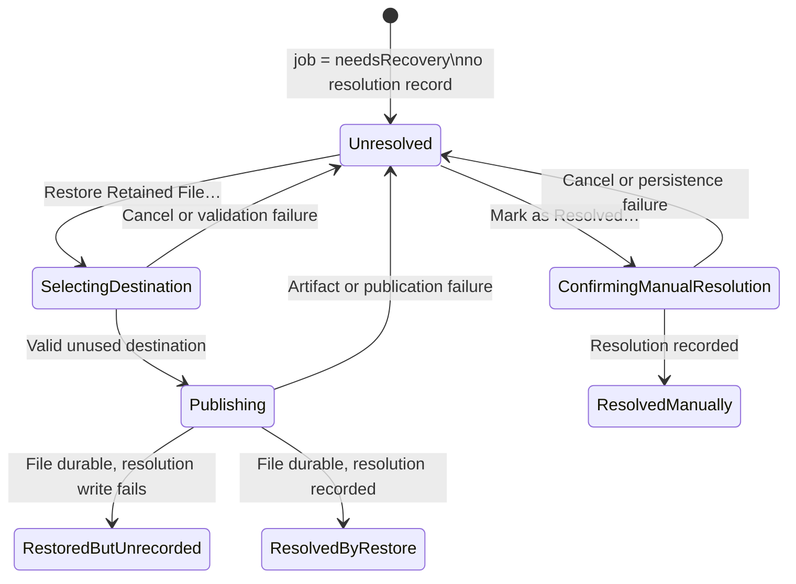

# Design — Recovery Store Restoration

Approved by: Chase Putnam  Date: 2026-07-29  Status: approved

## Overview

FileFlip will treat `needsRecovery` as the historical conversion outcome and persist a separate, append-only recovery resolution. An item is actionable only when its job outcome is `needsRecovery`, its recorded conversion behavior is `replaceWithBackup`, and no resolution record exists. Eligibility follows the immutable behavior stored on that history job, not the current future-job default. This preserves the original failure audit trail, prevents `keepOriginal` jobs from presenting inapplicable recovery UI, and keeps an existing recovery item actionable if the user later changes Settings.

Restoration will copy a verified retained artifact to a user-selected destination through a same-directory temporary file, publish it with an exclusive rename, flush the destination directory, and only then persist the resolution. The current user-visible file is never opened for writing, renamed, or removed.



## Decisions

### 1. Preserve the job outcome; store resolution separately

Add schema version 3 with a `recovery_resolution` table:

```sql
CREATE TABLE recovery_resolution (
    job_id TEXT PRIMARY KEY
        REFERENCES conversion_job(id) ON DELETE CASCADE,
    method TEXT NOT NULL CHECK (method IN ('restored', 'acknowledged')),
    destination_filename TEXT,
    resolved_at REAL NOT NULL,
    CHECK (
        (method = 'restored' AND destination_filename IS NOT NULL)
        OR (method = 'acknowledged' AND destination_filename IS NULL)
    )
);
```

The journal API exposes:

```swift
public enum RecoveryResolutionMethod: String, Codable, Sendable {
    case restored
    case acknowledged
}

public struct RecoveryResolutionRecord: Hashable, Codable, Sendable {
    public let jobID: UUID
    public let method: RecoveryResolutionMethod
    public let destinationFilename: String?
    public let resolvedAt: Date
}

public func recoveryResolution(jobID: UUID) throws -> RecoveryResolutionRecord?
public func resolveRecovery(_ resolution: RecoveryResolutionRecord) throws
public func unresolvedRecoveryJobs() throws -> [JournalJob]
```

`resolveRecovery` is one-way and insert-only. It succeeds only when the referenced job exists in `needsRecovery` and has no prior resolution. A duplicate or non-recovery job is rejected as an invalid transition. Existing version-2 databases migrate without synthesized rows, so every existing `needsRecovery` item remains unresolved after upgrade and relaunch.

Only the destination filename is persisted. The full selected path is not stored in history, notifications, support-facing errors, or accessibility text.

**Rejected alternatives**

- Changing the job to `succeeded`: loses the fact that the conversion itself required recovery and conflates conversion output with restored retained data.
- Adding `recovered` and `acknowledged` job states: expands the transaction state machine with post-terminal states and weakens the existing meaning of terminal conversion outcomes.
- Keeping resolution only in view state: cannot satisfy relaunch persistence or safe retention.

### 2. Model recovery independently from undo availability

`HistoryItemState.Availability` currently describes whether a successful conversion can be undone. Recovery needs different semantics, so it will not overload that enum.

Add:

```swift
enum RecoveryArtifactAvailability: Hashable, Sendable {
    case available
    case unavailable
}

enum RecoveryState: Hashable, Sendable {
    case notApplicable
    case unresolved(artifact: RecoveryArtifactAvailability)
    case resolvedByRestore(filename: String, date: Date)
    case resolvedManually(date: Date)
}
```

`HistoryItemState` receives `recoveryState`. Derived properties provide `needsRecoveryAction`, `canRestoreRetainedFile`, and resolved display text. The runtime computes artifact availability only for unresolved recovery jobs by requiring:

Recovery state is `.notApplicable` unless the history job’s recorded `conversionBehavior` is `.replaceWithBackup`. The current Settings default is deliberately not consulted: it configures future jobs and cannot hide, disable, or reveal recovery for an existing job. A `.keepOriginal` job never presents the medical-bag recovery state, restore action, or manual-resolution action.

1. A backup journal row for the job.
2. A storage path contained beneath FileFlip’s recovery root.
3. A regular, non-symbolic-link artifact.
4. A readable artifact whose SHA-256 equals the recorded backup hash.

History rows and details distinguish:

- `Recovery required` — unresolved, artifact available.
- `Recovery data unavailable` — unresolved, no verified restorable artifact; manual resolution remains available.
- `Recovered as <filename>` — resolved through FileFlip.
- `Resolved manually` — user acknowledged external or unavailable recovery.

No private recovery-store path is exposed by these checks or labels.

### 3. Use a dedicated fail-closed restoration transaction

Add `RecoveryCoordinator.restoreRetainedFile(jobID:destination:)`. Do not widen the existing undo-conflict `restoreToNewFile` contract; recovery restoration adds lifecycle recording and stricter preconditions that successful-conversion undo does not have.

Preconditions:

1. The job exists, is `needsRecovery`, and has no resolution record.
2. The backup row exists and its relative storage path resolves beneath the configured recovery root.
3. `lstat` identifies the retained artifact as a regular file, not a symlink or other filesystem object.
4. The retained artifact hash matches the recorded SHA-256.
5. The chosen destination’s parent is accessible and the destination leaf does not exist.

Publication sequence:

1. Revalidate the artifact immediately before copying.
2. Create a uniquely named hidden temporary file in the destination directory with exclusive creation semantics.
3. Clone or copy the artifact into that temporary file.
4. Verify the temporary file hash against the backup record.
5. Decode and apply the retained `FileMetadata`; default safely if metadata is malformed rather than weakening byte verification.
6. Flush the temporary file.
7. Publish with `renameatx_np(..., RENAME_EXCL)` so a destination created after the initial check is never overwritten.
8. Flush the destination directory. Success is not reported before this completes.
9. Insert a `.restored` resolution containing only `destination.lastPathComponent` and the resolution time.

A scoped cleanup removes only the transaction’s own unpublished temporary file. It never removes the destination, current visible file, or retained artifact.

If steps 1–8 fail, the item stays unresolved and the retained artifact remains available. If step 9 fails after durable publication, return a distinct `restoredButStatusUpdateFailed(filename:)` result/error. The UI must say that the named file was restored but FileFlip could not update recovery status; the item and medical-bag icon remain unresolved and retry remains possible to another unused destination.

Destination conflicts remain recoverable. The coordinator returns a typed conflict error and the UI offers destination selection again.

### 4. Use the standard save panel without granting overwrite semantics

The history detail action `Restore Retained File…` presents an explanatory confirmation before `NSSavePanel`:

- Names the affected file.
- States that FileFlip will create a separate file.
- States that the current visible file will not be overwritten.

The panel suggests `<original stem> — Recovered.<original extension>`. When the original authorized root is accessible, `directoryURL` starts at the original file’s parent; otherwise macOS chooses the default location. A save-panel delegate rejects any already occupied destination before panel acceptance. The core exclusive rename remains authoritative against races.

Cancellation returns without calling the runtime and changes no state.

After complete success, FileFlip refreshes the snapshot, selects the resolved item, presents `Recovery Complete` with the restored filename, and offers `Reveal in Finder`. Finder reveal is a convenience after the required durable restoration and does not affect resolution if it fails.

Typed user-visible failures are:

| Failure | Message direction | State |
|---|---|---|
| Destination exists | Choose a different name or location | Unresolved |
| Artifact missing/inaccessible/not regular | Retained recovery data is unavailable; retry access or resolve manually | Unresolved |
| Hash mismatch | Integrity check failed; no file was restored | Unresolved |
| Destination permission denied | Choose a writable location | Unresolved |
| Copy, flush, or exclusive publish failed | File could not be durably restored; choose another location or retry | Unresolved |
| Resolution insert failed after publish | `<filename>` was restored, but recovery status could not be updated | Unresolved |

Errors contain no private path, artifact bytes, or provider output.

### 5. Make manual resolution explicit and auditable

Every unresolved recovery detail includes a secondary `Mark as Resolved…` action, even when the artifact is unavailable. Its destructive confirmation states:

- FileFlip will stop warning about this item.
- No file will be restored.
- The retained artifact will become eligible for configured cleanup.

Confirmation inserts an `.acknowledged` resolution. Cancellation performs no write. Persistence failure leaves the item unresolved and presents an actionable error. History permanently displays `Resolved manually` while the row exists.

### 6. Derive status and retention from unresolved records

The view model replaces checks for `item.outcome == .needsRecovery` with `item.needsRecoveryAction`. On every snapshot, including startup, the first unresolved recovery item wins status precedence and drives the medical-bag icon and detail. Resolving one item triggers an immediate snapshot refresh:

- Another unresolved item exists: keep `.needsRecovery` and name that item in status detail.
- None remain: recalculate converting, failure, pause, blocked, degraded, monitoring, or idle state using the existing precedence.

Retention queries exclude backups whose jobs are `needsRecovery` and have no resolution row, regardless of age or byte pressure. Resolved recovery backups use their existing expiration and configured size policy. `Clear History` likewise excludes unresolved recovery jobs and their artifacts; resolved recovery rows are clearable with the rest of terminal history. The confirmation text explains when unresolved recovery items will remain.

This protection is enforced in journal SQL, not only in UI filtering, so direct pruning and history-clear calls cannot delete unresolved recovery data.

### 7. Route recovery notifications directly to the item

Successful restoration posts a local notification after both durable publication and resolution persistence:

- Title: `Retained File Restored`
- Body: `<filename> was restored successfully.`
- User info: recovery job UUID only
- Category: recovery history navigation

Existing `File Recovery Required` notifications receive the same job UUID routing payload. A `UNUserNotificationCenterDelegate` forwards notification responses to an app-scoped navigation coordinator. The coordinator activates FileFlip, opens the `history` window, and places the job UUID in `FileConvertViewModel.selectedHistoryItemID`. `HistoryView` binds selection to that model property so the corresponding detail opens directly.

The menu status area also shows `Review Recovery…` while recovery is unresolved. It sets the first unresolved job as the selected history item and opens the same window. Recent-activity recovery rows use the same route rather than opening an unspecified history entry.

Notification authorization remains subject to macOS settings. A denied notification does not fail restoration; the in-app success confirmation remains authoritative.

## Component changes

### FileConvertCore

- `JournalStore.swift`: schema v3 migration, resolution model and APIs, unresolved query, prune and clear-history guards.
- `RecoveryUndo.swift`: dedicated restoration transaction, artifact containment/type/hash validation, typed restoration outcomes/errors, manual resolution entry point.
- Existing conversion and undo state machines remain unchanged.

### FileConvertApp

- `ApplicationRuntime.swift`: add restore-recovery and manual-resolution operations.
- `ConcreteApplicationRuntime.swift`: map persisted resolution and verified artifact availability into history; invoke recovery coordinator; prune resolved artifacts under normal policy.
- `AppViewState.swift`: add recovery state and derived presentation properties.
- `FileConvertViewModel.swift`: destination selection workflow, confirmations, typed feedback, success notification, persisted unresolved status derivation, and selected-history routing.
- `AppViews.swift`: recovery actions, resolved/unavailable presentation, menu `Review Recovery…`, selection binding, and Finder reveal action.
- `FileConvertApp.swift`: install notification-response routing and inject the shared navigation state.

## Correctness invariants

1. Restoration never writes, renames, or deletes the current visible file.
2. No existing destination filesystem object is overwritten, including under a selection/publication race.
3. Published bytes match the recorded retained-artifact hash.
4. A recovery resolution cannot exist for a non-`needsRecovery` job and cannot be replaced by a later resolution.
5. A job is resolved only after its restored file is durable, or after explicit confirmed manual acknowledgement.
6. Automatic pruning and history clearing cannot delete an unresolved recovery artifact.
7. User-visible and support-facing output never contains the private recovery-store path.
8. The medical-bag icon is derived from persisted unresolved items, never from session memory.
9. Recovery eligibility follows the job’s recorded conversion behavior; changing the future-job default cannot strand or reveal historical recovery actions.

## Verification strategy

### Journal and migration tests

- Version-2 migration leaves existing recovery jobs unresolved.
- Resolution insert accepts one valid recovery job and rejects duplicates/non-recovery jobs.
- Relaunching the journal preserves restore/manual resolution metadata.
- Pruning and clear-history exclude unresolved recovery backups under both expiration and size pressure.
- Resolved recovery backups become eligible under the existing policy.

### Core transaction tests

Use a real temporary filesystem and retained bytes; no mocked publication:

- Exact restore publishes matching bytes and records `.restored` only after publication.
- Current visible file remains byte-for-byte and metadata unchanged.
- Existing file, directory, and symlink destinations are never replaced.
- A destination race at the exclusive rename is refused.
- Missing, unreadable, non-regular, path-escaping, and hash-mismatched artifacts fail closed.
- Copy, file-flush, directory-flush, and resolution-write failpoints leave the correct unresolved/durable state.
- Retry after a pre-publication failure succeeds.
- Manual resolution records `.acknowledged` without creating a user-visible file.

### App model and UI tests

- Startup with unresolved items shows the medical-bag icon; startup with only resolved items does not.
- Resolving one of multiple items keeps recovery status; resolving the last recalculates normal status immediately.
- Available, unavailable, restored, and manually resolved details show the correct actions and labels.
- A `replaceWithBackup` recovery job remains actionable after changing the current default to `keepOriginal`; a `keepOriginal` job never shows recovery state or actions.
- Save cancellation performs no runtime operation.
- Destination conflict returns to destination choice without overwrite.
- Success alert and notification contain only the restored filename.
- Post-publication resolution failure reports restored-but-unresolved state.
- Selecting a recovery notification and `Review Recovery…` opens History with the matching item selected.
- Manual-resolution cancellation and persistence failure leave status unchanged.

### End-to-end smoke scenario

Seed a real `needsRecovery` job and retained artifact in an isolated UI-test store, launch FileFlip, restore through the save panel, and assert:

1. The original/current visible file is unchanged.
2. The selected destination contains the retained bytes.
3. History reads `Recovered as <filename>`.
4. The medical-bag icon clears when this was the final unresolved item.
5. Relaunch preserves the resolved presentation and normal menu status.

## Requirements traceability

| Requirements | Design sections |
|---|---|
| 1.1–1.6 | 2, 4 |
| 2.1–2.7 | 3, 4, Correctness invariants |
| 3.1–3.7 | 1, 2, 3, 6 |
| 4.1–4.6 | 1, 5 |
| 5.1–5.6 | 4, 6, 7 |
