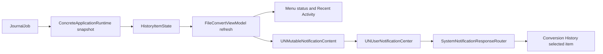

# Design Document

## Overview

Refresh the existing SwiftUI menu-bar popover without replacing native macOS interaction patterns. The website artwork supplies hierarchy and semantic color direction; SwiftUI supplies system typography, control behavior, accessibility, and appearance adaptation. Conversion outcomes continue to live in persisted history and are submitted to `UNUserNotificationCenter`; FileFlip does not render a second notification surface.

## Design decisions

### Native adaptation, not pixel replication

The website graphic uses a fixed cream card, custom web typography, and simulated notification chrome. The application will adapt those ideas to native SwiftUI:

- Preserve system fonts and native buttons.
- Use dynamic semantic colors that resolve separately in Light and Dark Mode.
- Use a warm neutral popover surface only when transparency is available; fall back to an opaque semantic surface for Reduce Transparency.
- Use SF Symbols, visible state text, and accessibility labels together.
- Let macOS own notification layout, app identity, timing, placement, and action presentation.

This avoids a fragile custom window or fake notification center and preserves keyboard, VoiceOver, Increase Contrast, Reduce Transparency, and Reduce Motion behavior.

### Persistent activity is not a notification surface

`Recent Activity` remains in the popover because it is persistent state/history and routes to Conversion History. No toast, banner, notification card, or auto-dismiss overlay will be added. Existing alerts and sheets remain limited to user-initiated errors, choices, and recovery workflows.

### Session-local status outcome

The menu status continues to derive failure/success from transitions observed after startup. Historical terminal jobs seed the observed-state map but do not change the default startup checkmark or replay notifications. A newly observed failed transition sets the session outcome to failure; a later newly observed successful transition clears it back to monitoring success.

## Visual system

### Dynamic color roles

Add adaptive colors in `AppDesignSystem.swift` using `NSColor(name:dynamicProvider:)` bridged into SwiftUI:

| Role | Light appearance | Dark appearance | Use |
|---|---|---|---|
| `popoverSurface` | warm off-white | warm near-black | Popover background |
| `primaryInk` | deep green-black | warm off-white | Primary status and filename text |
| `secondaryInk` | muted green-gray | muted light gray | Detail and metadata |
| `success` | deep/mid green | light mint-green | Monitoring and success |
| `successFill` | pale mint | translucent deep green | Success icon tile |
| `warning` | coral-orange | light coral | Choice and warning |
| `warningFill` | pale coral | translucent rust | Warning icon tile |
| `critical` | system red-adjacent coral | light red | Failure, blocked, recovery |
| `criticalFill` | pale red/coral | translucent dark red | Failure icon tile |
| `progress` | system blue | light blue | Active conversion |
| `progressFill` | pale blue | translucent dark blue | Active icon tile |
| `divider` | muted green at low opacity | white at low opacity | Section boundaries |
| `controlFill` | muted warm gray | translucent white | Compact controls and row hover |

System colors remain the contrast fallback when Increase Contrast is enabled. Color never carries state alone.

### Spacing and shape

- Popover width: keep the current compact 360-point width.
- Outer padding: 16 points.
- Header: 12-point internal spacing; status indicator tile 34 points; compact trailing pause/resume button.
- Section gaps: 12–16 points with full-width dividers.
- Section label: native caption, semibold, uppercase, increased tracking.
- Activity rows: full-width, 8–10 point vertical padding, 8–10 point corner radius.
- Activity icon tile: 32 points, 8-point radius, semantic foreground/fill pair.
- Navigation row: compact native controls with existing shortcuts.

### Status header

Replace the stacked title/detail plus separate prominent pause button with one compact header:

1. Rounded semantic state icon tile.
2. VStack containing prominent status title and watched-folder/current-state detail.
3. Trailing compact bordered pause/resume button when folders are authorized.

When no folder is authorized, retain the current actionable empty state and folder authorization button below the status header.

### Recent activity row

Each row contains:

1. Rounded semantic state icon tile selected from the persisted outcome.
2. Filename, one line.
3. `SOURCE → TARGET · Outcome` secondary text, one line where possible.
4. Relative timestamp.
5. `chevron.right` navigation affordance.

The whole row remains a native button that selects the item and opens Conversion History. The accessible label states filename, outcome, source format, and target format.

## Notification design

### Data model

Add an optional `conversionDuration` to `HistoryItemState`. `ConcreteApplicationRuntime.snapshot()` derives it from persisted `JournalJob.createdAt` and `updatedAt` for terminal conversion outcomes using `max(0, updatedAt.timeIntervalSince(createdAt))`. This is authoritative persisted metadata; it does not infer timing from notification observation.

### Content mapping

| Outcome | Title | Subtitle | Body | Category |
|---|---|---|---|---|
| Success | `Conversion complete` | `SOURCE → TARGET · <duration>` when duration exists; otherwise `SOURCE → TARGET` | `<basename> was converted successfully.` | `FILEFLIP_HISTORY` |
| Failure | `Conversion failed` | `SOURCE → TARGET` | `<basename> could not be converted. The original filename was restored. <safe next action>` | `FILEFLIP_HISTORY` |
| Recovery required | `File recovery required` | `SOURCE → TARGET` | Existing redacted recovery explanation plus safe next action | `FILEFLIP_RECOVERY` |

All outcome notifications set:

- `threadIdentifier = "fileflip.conversions"`
- default sound
- `userInfo["historyItemID"]`
- a stable request identifier containing job ID and outcome

No root path, bookmark, hash, command line, or diagnostic detail is included.

### Categories and routing

Register two categories in `SystemNotificationResponseRouter`:

- `FILEFLIP_HISTORY` with a foreground `View in History` action.
- `FILEFLIP_RECOVERY` with the existing foreground `Review Recovery…` action.

Default taps and either action activate FileFlip and request Conversion History navigation for the corresponding `historyItemID`.

### Authorization and failure behavior

The current authorization request remains asynchronous after at least one folder is authorized. Denial or posting failure does not affect conversion, history, or menu status and does not create substitute in-app chrome. A notification outcome is recorded as delivered only after `NotificationService.post` succeeds, while unchanged observed state prevents repeated submission during the same run.

## Data flow

## Files and interfaces

- `Sources/FileConvertApp/AppDesignSystem.swift`
  - Add adaptive color roles and reusable semantic state/icon-tile helpers.
- `Sources/FileConvertApp/AppViews.swift`
  - Recompose `MenuBarContentView` status header and `RecentActivityRow`.
  - Preserve all current action closures, shortcuts, and accessibility identifiers.
- `Sources/FileConvertApp/AppViewState.swift`
  - Add `conversionDuration` to `HistoryItemState` and outcome presentation helpers as needed.
- `Sources/FileConvertApp/ConcreteApplicationRuntime.swift`
  - Map persisted job timestamps into duration.
- `Sources/FileConvertApp/FileConvertViewModel.swift`
  - Populate notification subtitle, exact approved titles, thread identifier, and stable category metadata.
- `Sources/FileConvertApp/FileConvertApp.swift`
  - Register history and recovery notification categories/actions and preserve item routing.
- `Tests/FileConvertAppTests/FileConvertViewModelTests.swift`
  - Cover startup non-replay, transitions, deduplication, permission failure, content, privacy fields, duration formatting, and routing state.
- `Tests/FileConvertUITests/FileConvertUITests.swift`
  - Cover the revised hierarchy, controls, activity navigation, and absence of transient custom outcome UI.

## Error handling and invariants

1. Notification delivery never gates or changes conversion state.
2. Initial historical outcomes never replay or change the default startup success icon.
3. The latest newly observed success/failure transition drives both status title and menu-bar icon.
4. Notification content comes from persisted job fields and contains no authorized path or diagnostics.
5. Failure text claims restoration only for ordinary `.failed` outcomes; `.needsRecovery` uses separate content.
6. Every interactive action remains a native control with its existing behavior and shortcut.

## Verification strategy

- Model tests: exact notification title/subtitle/body/category/thread/userInfo; duration present/absent; success/failure/recovery; denial/post failure; startup non-replay; same-state deduplication; in-flight-to-terminal transitions; latest-session menu status.
- Runtime mapping test: `createdAt`/`updatedAt` produces the expected nonnegative duration.
- UI automation: header title/detail, compact pause/resume, uppercase Recent Activity label, row content/navigation, History/Settings/Quit, empty state, and no custom notification card/banner/toast.
- Smoke test: launch the built app, drive representative success and failure scenarios, verify menu state and system notification request behavior.
- Visual inspection: capture popover in Light and Dark Mode and confirm hierarchy, clipping, semantic state differentiation, and contrast; enable Reduce Transparency/Increase Contrast/Reduce Motion for targeted accessibility checks.
